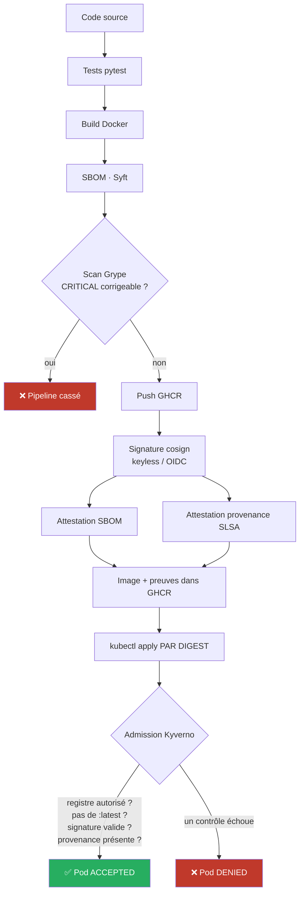

# 🔐 Projet — Sécuriser la chaîne d'approvisionnement logicielle (Software Supply Chain Security / SLSA)

> **Module : Projet Technique — 5ᵉ année DevOps, Cloud & Infrastructure**
> Format : **3 jours** · ~**1,5 jour de projet** + **QCM** + **soutenance** (après-midi du dernier jour).

## Le pitch en une phrase

Vous avez déjà construit des pipelines CI/CD. Ici, on répond à la question que se
posent aujourd'hui toutes les équipes DevSecOps : **« comment prouver qu'une image
qui tourne en production est bien celle que *nous* avons construite, à partir du code
que *nous* avons revu — et pas une version piégée ? »**

Vous allez transformer un pipeline classique en **chaîne d'approvisionnement vérifiable**,
et déployer un cluster qui **refuse activement** toute image qu'il ne peut pas prouver
digne de confiance.

```
 code ──► build ──► SBOM (Syft) ──► scan (Grype) ──► SIGNATURE (cosign/Sigstore)
                                                        │
                                                        ├─► attestation SBOM
                                                        └─► attestation de PROVENANCE (SLSA)
                                                                    │
                                                             push ──► GHCR (registry)
                                                                    │
   ┌────────────────────────────────────────────────────────────────┘
   ▼
Cluster Kubernetes (kind / k3s) + KYVERNO (admission control)
   ├─ image signée par NOTRE identité ?          sinon ─► ❌ REFUSÉE
   ├─ attestation de provenance présente ?        sinon ─► ❌ REFUSÉE
   ├─ registry autorisé + tag par digest ?        sinon ─► ❌ REFUSÉE
   └─ pas de vulnérabilité CRITICAL non corrigée ? sinon ─► ❌ REFUSÉE
```

**La démo de soutenance :** vous déployez votre image signée → ✅ elle tourne.
Vous déployez une image *non signée* ou *modifiée après signature* → ❌ **le cluster la bloque**,
en direct.

### Diagramme d'architecture



## En quoi c'est nouveau (≠ CI/CD que vous avez déjà fait)

| Vous savez déjà faire | Ce projet ajoute (le vrai sujet) |
|---|---|
| Build une image dans un pipeline | Prouver **qui** l'a construite et **comment** (provenance SLSA) |
| Lancer Trivy dans la CI | Produire un **SBOM** signé et **attaché** à l'image comme attestation |
| `kubectl apply` d'un Deployment | Un cluster à **admission control** qui *rejette* l'inconnu (Kyverno) |
| « le scan est vert » | **Vérifier la signature** au moment du déploiement (zero-trust) |
| Sécurité = étape du pipeline | Sécurité = **propriété vérifiable** de bout en bout |

## Pourquoi ça compte (contexte réel)

Les attaques 2020-2024 ne visent plus votre app : elles visent **votre chaîne de build**.
- **SolarWinds (2020)** — du code malveillant injecté dans le *build*, signé par l'éditeur, poussé à 18 000 clients.
- **Codecov (2021)** — un script CI modifié exfiltrant les secrets des pipelines de milliers de projets.
- **dependency confusion (2021)** — de faux paquets internes publiés sur les registries publics.
- **XZ Utils / `liblzma` (2024)** — une backdoor introduite sur *3 ans* dans une dépendance open source.

La réponse de l'industrie : **SLSA**, **Sigstore/cosign**, **SBOM**, **attestations**, et
**policy-as-code à l'admission**. C'est exactement ce que vous allez mettre en œuvre.

## Structure du dépôt

```
supply-chain-security-project/
├── README.md                    ← vous êtes ici
├── docs/                        présentation, prérequis, planning, évaluation, architecture,
│                                 guide de démo, dépannage, fiche de révision
├── app/                         application fournie (API Flask) — le sujet, c'est la chaîne autour
├── labs/                        les 5 labs guidés (le cœur des 1,5 jour)
│   ├── lab0-setup.md
│   ├── lab1-build-sbom.md
│   ├── lab2-sign-attest.md
│   ├── lab3-cluster-admission.md
│   ├── lab4-attaque-defense.md
│   └── lab5-ci-bout-en-bout.md  (bonus / intégration finale)
├── scripts/                     automatisation de la chaîne (voir Makefile ci-dessous)
├── artifacts/                   SBOM/provenance générés localement (ignorés par git)
├── cluster/                     config kind + install Kyverno
├── policies/kyverno/            les politiques d'admission (le "gardien" du cluster)
├── k8s/                         manifs de déploiement de l'app + k8s/attacks/ (scénarios de refus)
├── .github/workflows/           pipeline supply-chain complet (référence)
├── evaluation/                  QCM + corrigé + grilles (soutenance & rapport)
├── livrables/                   rapport, threat model, notes de soutenance
├── .env.example                 paramètres non secrets à copier en .env et personnaliser
└── Makefile                     toutes les étapes de la chaîne en une commande (make help)
```

## Par où commencer

1. Lisez [`docs/00-presentation-projet.md`](docs/00-presentation-projet.md) puis [`docs/02-planning-3-jours.md`](docs/02-planning-3-jours.md).
2. Installez les outils : [`docs/01-prerequis-setup.md`](docs/01-prerequis-setup.md).
3. Copiez `.env.example` en `.env` et remplacez les placeholders `<...>` par vos valeurs (voir
   [`docs/01-prerequis-setup.md`](docs/01-prerequis-setup.md)).
4. Enchaînez les labs [`labs/lab0-setup.md`](labs/lab0-setup.md) → `lab4` — chaque lab explique la
   commande brute **et** le script `make`/`scripts/*.sh` équivalent.
5. Préparez vos [livrables](docs/03-livrables-evaluation.md) et votre démo
   ([`docs/demo-guide.md`](docs/demo-guide.md)).

## Automatisation (`make`)

Toutes les étapes de la chaîne sont scriptées dans `scripts/` et exposées via `make` :

```bash
make help             # liste toutes les cibles
make check-prereqs    # vérifie les outils installés (ou : ./scripts/check-prerequisites.sh)
make build sbom scan  # build → SBOM → scan (100% local, aucun compte requis)
make push             # authentification GHCR + push (nécessite votre compte)
make sign attest       # signature keyless + attestations (export DIGEST=sha256:... requis)
make verify           # vérifie signature + identité
make cluster-create kyverno-install   # cluster kind + Kyverno
make deploy           # déploie PAR DIGEST (export DIGEST=sha256:...)
make demo             # scénarios d'attaque/défense réels (kubectl + Kyverno)
```

Aucune cible ne masque un échec : un scan qui casse, une signature invalide ou une politique
qui refuse font échouer la commande avec le vrai message d'erreur.

> **Voies d'exécution :** tout tourne **en local** (Docker + `kind` ou `k3s`), *aucun cloud requis*.
> Une variante **Azure** (AKS + Azure Container Registry + politiques) est indiquée en encart pour
> les groupes disposant de la licence Student.
