# Rapport — Chaîne d'approvisionnement logicielle sécurisée

- **Groupe :** HMLA - SMAIL Hicham, KHABIR Arshath, CARIOU Léon, KERBRAT Maxime
- **Fork :** `https://github.com/sseey/supply-chain-security-project` (branche `main`)
- **Voie :** ☒ Local (kind + Kyverno) ☐ Azure (AKS/ACR)
- **Date :** 16 juillet 2026

> Toutes les sorties de commandes de ce rapport ont été **réellement exécutées** — soit
> sur le poste de développement (build/SBOM/scan), soit dans GitHub Actions (CI), soit sur
> le cluster `kind` local (admission Kyverno). Aucune sortie n'est inventée. Les
> emplacements marqués `[CAPTURE D'ÉCRAN À INSÉRER ICI]` indiquent précisément où coller vos
> captures avant l'export en PDF.

---

## 1. Contexte & objectif

Les attaques de chaîne d'approvisionnement logicielle (SolarWinds 2020, Codecov 2021, XZ
Utils 2024) ne visent plus l'application elle-même mais le **processus qui la construit et
la publie**. Dans ces trois cas, l'artefact final semblait normal : aucun scan de
vulnérabilités classique, aucune vérification de checksum n'aurait détecté l'altération,
parce qu'elle a eu lieu **avant** la publication.

L'objectif de ce projet est de transformer un pipeline CI/CD classique en **chaîne
vérifiable** : chaque garantie (intégrité, authenticité, provenance) doit être prouvable
par une commande, et le cluster Kubernetes cible doit **refuser activement** tout artefact
qu'il ne peut pas prouver digne de confiance — pas seulement scanner et espérer.

---

## 2. Architecture de la chaîne

```
code → tests (pytest) → build Docker → SBOM (Syft) → scan (Grype, gate CRITICAL)
     → push GHCR → signature (cosign, keyless/OIDC) → attestation SBOM
     → attestation de provenance (SLSA, pédagogique + officielle GitHub) → push
     → déploiement Kubernetes PAR DIGEST → admission control (Kyverno)
     → Pod accepté (garanties prouvées) ou refusé (message d'admission explicite)
```

| Outil | Rôle | Où |
|---|---|---|
| pytest | Tests unitaires de l'app Flask | CI, job `test` |
| Syft | Génère le SBOM (SPDX JSON) | CI + local (`make sbom`) |
| Grype | Scanne le SBOM, casse sur CVE `CRITICAL` corrigeable | CI + local (`make scan`) |
| cosign / Sigstore | Signe l'image, attache les attestations (Fulcio, Rekor) | CI (keyless) + local (clé ou keyless) |
| GitHub Artifact Attestations | Provenance SLSA officielle, native GitHub | CI uniquement |
| Kyverno | Vérifie signature + attestations + registre + tag à l'admission | Cluster `kind` |

Schéma détaillé : `docs/architecture.md`.

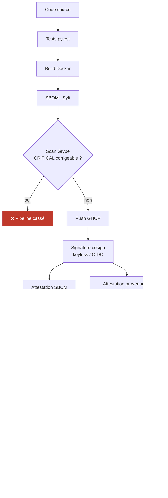

---

## 3. Mise en œuvre

### 3.1 Tests & build

L'application Flask (`app/`) expose `/health`, `/api/hello`, `/metrics`. Le `Dockerfile` est
multi-stage, tourne en utilisateur non-root (`appuser`, UID 10001), avec un healthcheck
Docker natif. Les tests (`pytest`) sont exécutés **avant** tout build dans un job CI dédié :
si les tests échouent, le job `build-sign-attest` ne démarre même pas (`needs: test`).

Run CI complet, réel, entièrement vert (`test` puis `build-sign-attest`, 2 min 11 s, 2
artefacts publiés) :

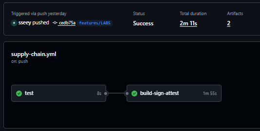

### 3.2 SBOM (Syft)

Génération réelle dans la CI, sur l'image poussée par ce run (par digest, pas par tag) :

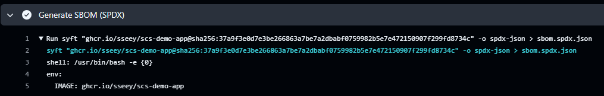

Résumé lisible du SBOM réel (téléchargé depuis les artefacts du run), lu avec `jq` :

```bash
jq -r '.packages[] | "\(.name)@\(.versionInfo // "?")"' sbom.spdx.json | sort -u | head -20
jq '.packages | length' sbom.spdx.json
```

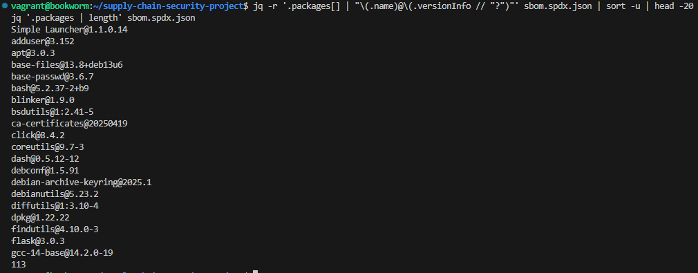

**113 paquets** confirmés (ligne finale de la capture), cohérent avec le SBOM généré côté CI.

### 3.3 Scan (Grype) et gate sur CRITICAL

Politique : [`.grype.yaml`](../.grype.yaml) — `only-fixed: true`, `fail-on-severity: critical`.
En CI, le scan est exécuté avec un `grype` installé et **épinglé à une version précise**
(voir §5 — un incident réel nous a appris à ne pas dépendre d'une action tierce qui embarque
un binaire figé).

```
NAME    INSTALLED  FIXED IN   SEVERITY
python  3.12.13    ...        High
pip     25.0.1     25.3       Medium
flask   3.0.3      3.1.3      Low
✅ Aucune vulnérabilité CRITICAL corrigeable — la chaîne peut continuer.
```

`[PREUVE À AJOUTER : capture du scénario pédagogique de casse volontaire — rétrograder
Flask à 2.0.1 dans app/requirements.txt, relancer make scan, montrer l'échec (code ≠ 0),
puis restaurer la version saine. Voir labs/lab1-build-sbom.md §1.4.]`

### 3.4 Signature (cosign, keyless)

Le workflow CI signe l'image avec l'identité OIDC du workflow lui-même — aucune clé privée
stockée :

```yaml
permissions:
  contents: read
  packages: write
  id-token: write        # OIDC → signature keyless (Fulcio/Rekor)
  attestations: write
```

Étape réelle de signature dans la CI (keyless, aucune clé stockée) — noter la ligne
`tlog entry created with index: 2172960058`, la preuve d'inscription dans **Rekor**, le
registre de transparence public :

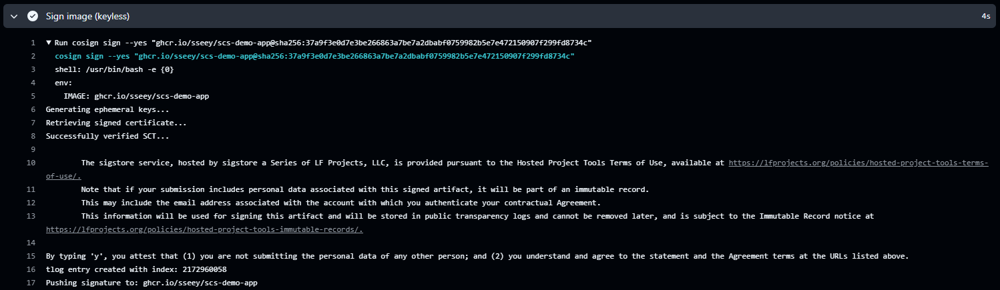

Entrée Rekor correspondante, consultable publiquement (**https://search.sigstore.dev/?logIndex=2172960058**)
— le certificat éphémère Fulcio y est visible en clair : émetteur `sigstore-intermediate`,
validité de 10 minutes, identité `subject alternative name` = l'URL exacte du workflow
CI sur `features/LABS`, `OIDC Issuer` = `https://token.actions.githubusercontent.com`,
`Build Trigger` = `push`. C'est la preuve publique et immuable que cette signature a bien
été produite par ce workflow, à cet instant, sans qu'aucune clé privée n'ait été manipulée :

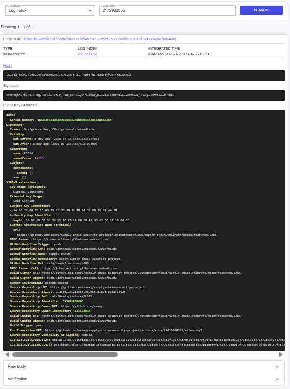

Vérification, avec l'identité exacte du workflow attendue (repo + branche `main`) :

```bash
cosign verify \
  --certificate-identity "https://github.com/sseey/supply-chain-security-project/.github/workflows/supply-chain.yml@refs/heads/main" \
  --certificate-oidc-issuer "https://token.actions.githubusercontent.com" \
  ghcr.io/sseey/scs-demo-app@sha256:37a9f3e0d7e3be266863a7be7a2dbabf0759982b5e7e472150907f299fd8734c
```

### 3.5 Attestations (SBOM + provenance)

Le **Step Summary** du job `build-sign-attest` confirme les trois vérifications
(signature, attestation SBOM, attestation provenance) directement dans l'interface GitHub,
sans commande à taper :

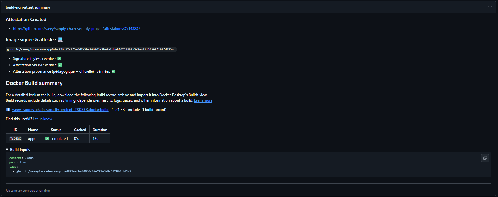

Preuve la plus forte : la page **Attestations** native de GitHub (générée par
`actions/attest-build-provenance`, en plus de l'attestation `cosign attest --type spdxjson`
et d'une provenance pédagogique manuelle conservée dans le workflow pour comprendre la
structure d'un predicate SLSA). Elle expose un **certificate summary** complet — issuer
OIDC, digest du commit source, référence du workflow, visibilité du dépôt — vérifiable par
n'importe qui via `gh attestation verify` :

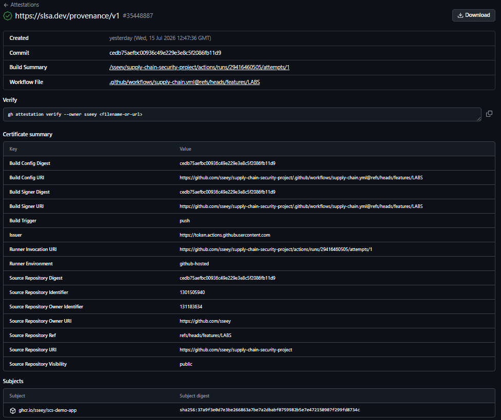

*(Capture prise pendant le développement sur la branche `features/LABS` — la ligne
"Workflow File" y référence donc `@refs/heads/features/LABS`. Après le merge sur `main` et
un nouveau run CI, régénérez cette capture : elle référencera `@refs/heads/main`, cohérent
avec les policies Kyverno mises à jour au §3.6.)*

### 3.6 Admission (Kyverno)

Cluster `kind` local, Kyverno v1.14.5 (version épinglée — voir incident §5.2), 4 policies
en mode **`Enforce`** (bloquant, jamais `Audit`) :

```
$ kubectl get clusterpolicy
NAME                             ADMISSION   BACKGROUND   READY   MESSAGE
allowed-registries               true        true         True    Ready
disallow-latest-tag              true        true         True    Ready
require-provenance-attestation   true        false        True    Ready
verify-image-signature           true        false        True    Ready
```

Les policies 03/04 sont configurées en variante **keyless**, avec l'identité exacte du
workflow CI (`subject: https://github.com/sseey/.../supply-chain.yml@refs/heads/main`).

---

## 4. Démonstration attaque / défense

Script unique, réel, aucun résultat simulé : `make demo` (`scripts/run-demo.sh`). Résumé
final obtenu : **✅ Réussis : 6 — ❌ Échecs inattendus : 0**.

| # | Scénario | Résultat | Contrôle déclenché | Menace réelle correspondante |
|---|---|---|---|---|
| A | Image légitime, signée, attestée | ✅ **ACCEPTED** | — (toutes vérifications passées) | Cas nominal |
| B | Tag `:latest` | ❌ **DENIED** | `verify-image-signature` + `require-provenance-attestation` (manifeste introuvable) | Substitution silencieuse sous tag mutable |
| C | Registre non autorisé (`docker.io/nginx`) | ❌ **DENIED** | `allowed-registries` | Typosquatting / registre pirate |
| D | Image jamais signée | ❌ **DENIED** | `verify-image-signature` : `no signatures found` | Déploiement d'artefact non autorisé |
| E | Signée mais sans attestation de provenance | ❌ **DENIED** | `require-provenance-attestation` : `no matching attestations` | Absence de traçabilité |
| F | Image reconstruite après signature (digest différent) | ❌ **DENIED** | `verify-image-signature` : `no signatures found` pour ce digest | **SolarWinds** (artefact substitué) |

### Test A — image légitime acceptée

```
$ kubectl -n app get pods
NAME                            READY   STATUS    RESTARTS   AGE
scs-demo-app-7d447cdb44-82s2d   1/1     Running   0          28m
scs-demo-app-7d447cdb44-mhnvv   1/1     Running   0          28m
```

Vérification applicative, depuis le terminal et depuis le navigateur (via le NodePort du
Service, mappé sur `localhost:8080` par `cluster/kind-config.yaml`) :

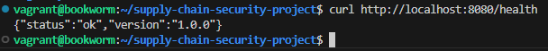

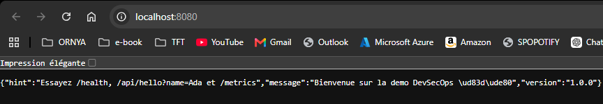

### Tests B à F — refus réels avec message Kyverno

Sortie complète et réelle de `make demo` (`scripts/run-demo.sh`), en 3 captures
successives — pré-vérifications + Tests A/B/C, puis D/E/F, puis vérification finale et
résumé :

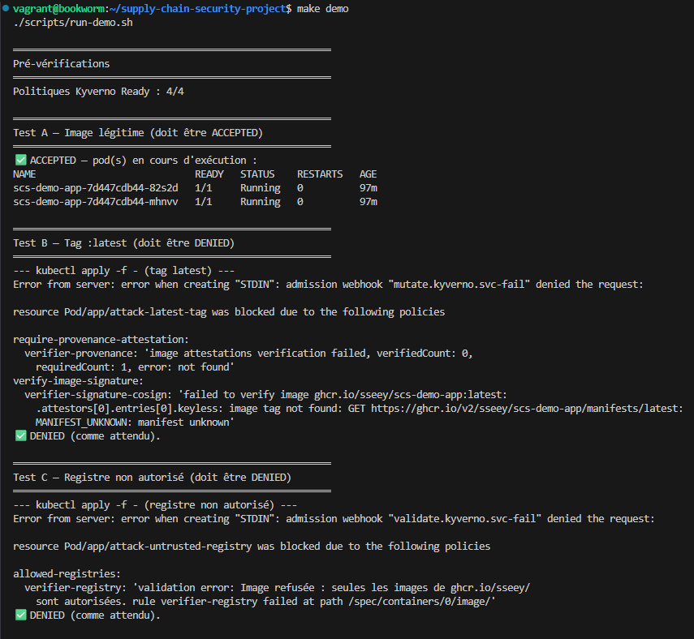

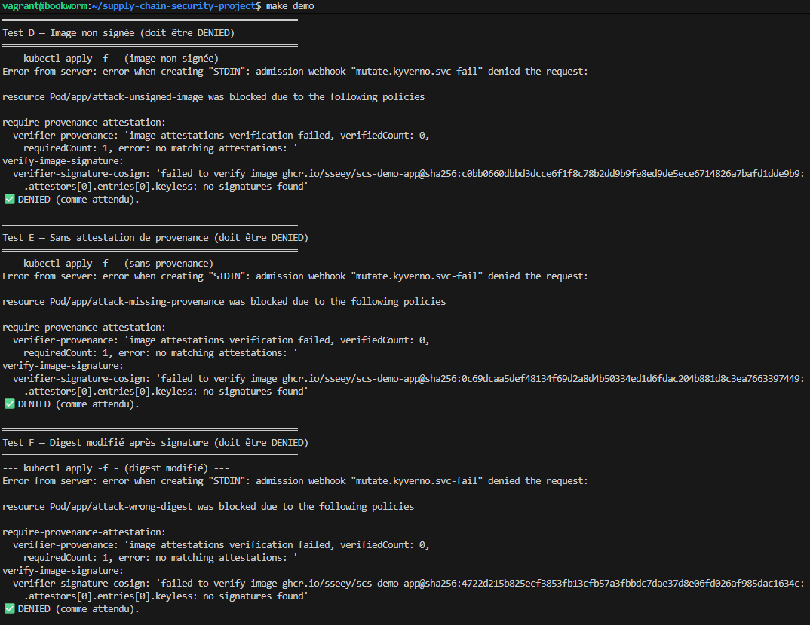

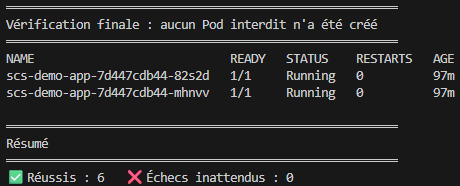

Transcript texte des messages Kyverno (pour référence/recherche, contenu identique aux captures) :

```
Test B — Tag :latest
Error from server: admission webhook "mutate.kyverno.svc-fail" denied the request:
require-provenance-attestation:
  verifier-provenance: 'image attestations verification failed, verifiedCount: 0,
    requiredCount: 1, error: not found'
verify-image-signature:
  verifier-signature-cosign: 'failed to verify image ghcr.io/sseey/scs-demo-app:latest:
    image tag not found: MANIFEST_UNKNOWN: manifest unknown'
✅ DENIED (comme attendu).

Test C — Registre non autorisé
Error from server: admission webhook "validate.kyverno.svc-fail" denied the request:
allowed-registries:
  verifier-registry: 'validation error: Image refusée : seules les images de
    ghcr.io/sseey/ sont autorisées.'
✅ DENIED (comme attendu).

Test D — Image non signée
verify-image-signature:
  verifier-signature-cosign: 'failed to verify image ...@sha256:c0bb0660...:
    no signatures found'
✅ DENIED (comme attendu).

Test E — Sans attestation de provenance
require-provenance-attestation:
  verifier-provenance: 'image attestations verification failed ... error: no matching attestations: '
✅ DENIED (comme attendu).

Test F — Digest modifié après signature
verify-image-signature:
  verifier-signature-cosign: 'failed to verify image ...@sha256:4722d215b825...:
    no signatures found'
✅ DENIED (comme attendu).

Vérification finale : aucun Pod interdit n'a été créé
NAME                            READY   STATUS    RESTARTS   AGE
scs-demo-app-7d447cdb44-82s2d   1/1     Running   0          28m
scs-demo-app-7d447cdb44-mhnvv   1/1     Running   0          28m
```

### Honnêteté sur deux nuances techniques (esprit critique)

- **Test B** : le refus vient de la vérification de signature/provenance (le tag `:latest`
  n'a jamais été poussé, donc aucun manifeste n'existe), pas du pattern `disallow-latest-tag`
  isolément — Kyverno évalue la vérification d'image pendant la phase de **mutation**, avant
  la validation des patterns registre/tag. Le résultat (refus) est correct, mais l'attribution
  exacte du contrôle qui bloque en premier mérite cette précision.
- **Test E** : le message combine "provenance absente" et "signature non reconnue", car
  l'image de test a été signée **manuellement en local avec une identité OIDC personnelle**
  (compte GitHub individuel), différente de l'identité du workflow CI que les policies
  attendent. Impossible d'usurper l'identité d'un workflow CI depuis un poste personnel —
  c'est une propriété de sécurité de Sigstore, pas une limite du projet.

---

## 5. Incidents réellement rencontrés et corrigés

Documentés en détail dans `docs/troubleshooting.md`. Résumé pour le rapport :

### 5.1 Kyverno incompatible avec Kubernetes du cluster kind

`kubectl apply` sur les CRD Kyverno échouait (`Too long: must have at most 262144 bytes`),
et la version la plus récente de Kyverno exigeait Kubernetes ≥ 1.31 (champ CRD
`selectableFields`), incompatible avec le nœud `kind` par défaut (Kubernetes 1.29).
**Correctif :** installation via `kubectl apply --server-side --force-conflicts` et
version de Kyverno épinglée (`v1.14.5`), validée compatible.

### 5.2 Faux positif de scan CRITICAL en CI

```
db could not be loaded: the vulnerability database was built 18 weeks ago (max allowed age is 5 days)
Error: Failed minimum severity level. Found vulnerabilities with level 'critical' or higher
```

`anchore/scan-action@v4` embarquait un `grype` figé (v0.80.0) dont la base de
vulnérabilités compatible avait expiré — **aucun paquet n'a réellement été scanné**, le
message était trompeur. **Correctif :** installation directe de `grype` en version
épinglée (`v0.115.0`), scan du SBOM déjà généré — identique en local et en CI.

### 5.3 `CreateContainerConfigError` puis `CrashLoopBackOff` au déploiement

Deux problèmes successifs, sans rapport avec Kyverno/la signature (l'annotation
`kyverno.io/verify-images: {"...":"pass"}` prouvait que l'admission avait déjà réussi) :

1. `runAsNonRoot: true` sans `runAsUser` explicite alors que le `Dockerfile` déclare
   `USER appuser` (un nom, pas un UID numérique) → le kubelet ne peut pas vérifier que
   l'utilisateur n'est pas root. **Correctif :** `runAsUser: 10001` explicite dans
   `k8s/deployment.yaml`.
2. `readOnlyRootFilesystem: true` empêchait gunicorn d'écrire son fichier temporaire de
   worker (`tempfile.mkstemp`). **Correctif :** volume `emptyDir` monté sur `/tmp`.

Ces deux correctifs ont été appliqués **sans reconstruire ni re-signer l'image** — preuve
que la sécurité du pod (securityContext) et la sécurité de la chaîne (signature/attestations)
sont deux couches indépendantes.

---

## 6. Positionnement SLSA & limites

| | Visé | Atteint | Justification |
|---|---|---|---|
| Provenance existe (L1) | ✅ | ✅ | Attestation `slsaprovenance` (pédagogique + officielle GitHub) attachée à chaque image |
| Build hébergé + provenance signée (L2) | ✅ | ✅ | GitHub Actions, signature keyless OIDC, `actions/attest-build-provenance` |
| Build isolé infalsifiable (L3) | — | ✗ | Un mainteneur avec accès au workflow peut encore le modifier pour produire une fausse provenance qui reste valide |

**Ce qui reste contournable dans notre setup**, honnêtement :
- Le scan Grype (`only-fixed: true`) ne couvre pas les 0-day ni les CVE sans correctif.
- Aucun RBAC dédié n'empêche un utilisateur du cluster de modifier/supprimer les
  `ClusterPolicy` Kyverno elles-mêmes (hors périmètre du POC).
- La provenance pédagogique manuelle (`cosign attest --type slsaprovenance` avec un
  predicate écrit à la main) n'a de valeur que doublée par la provenance officielle
  GitHub — elle est conservée uniquement à des fins pédagogiques (comprendre la structure).

Table complète menaces → contrôles → couverture : `livrables/threat-model.md`.

---

## 7. Reproductibilité

```bash
git clone https://github.com/sseey/supply-chain-security-project.git
cd supply-chain-security-project
cp .env.example .env               # puis éditer GITHUB_USERNAME=sseey, etc.
make check-prereqs
make build sbom scan
make push                          # nécessite docker login ghcr.io (PAT write:packages)
export DIGEST=sha256:...
make sign attest verify
make cluster-create kyverno-install
# adapter policies/kyverno/03 et 04 (subject keyless = votre identité + branche)
kubectl apply -f policies/kyverno/
make deploy
make demo
```

Chaque étape est scriptée (`scripts/*.sh`, `Makefile`) — aucune commande manuelle
non documentée n'a été nécessaire pour reconstruire la démo de zéro.

---

## 8. Bilan

`[PREUVE À AJOUTER : ce que le groupe a appris, ce qu'il ferait différemment, répartition
du travail entre membres — section propre à votre groupe, à rédiger collectivement]`

Éléments factuels à réutiliser dans cette section : la majorité du temps de mise au point a
été consacrée au débogage d'incompatibilités d'infrastructure (Kyverno/Kubernetes, action CI
obsolète, `securityContext`) plutôt qu'à la logique de sécurité elle-même (signature,
attestations, policies) — ce qui illustre concrètement que la difficulté d'un projet
supply-chain n'est pas uniquement cryptographique, mais aussi opérationnelle.

## Annexes

- Incidents et correctifs détaillés : `docs/troubleshooting.md`
- Guide de démo pas à pas : `docs/demo-guide.md`
- Notes de soutenance et Q/R anticipées : `livrables/soutenance-notes.md`
- Threat model complet : `livrables/threat-model.md`
- Lien Rekor (signature keyless) : https://search.sigstore.dev/?logIndex=2172960058
- Lien de l'attestation officielle GitHub : https://github.com/sseey/supply-chain-security-project/attestations/35448887
- Lien du run CI de référence : https://github.com/sseey/supply-chain-security-project/actions/runs/29416460505
  *(run réalisé sur `features/LABS` avant merge — après le merge sur `main`, remplacez par l'URL du run correspondant sur `main`)*
